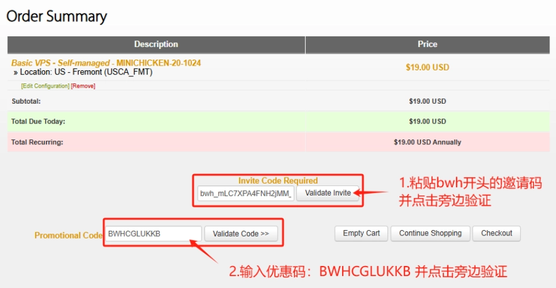
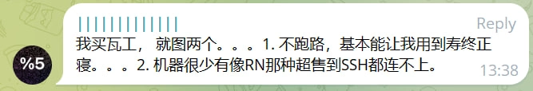
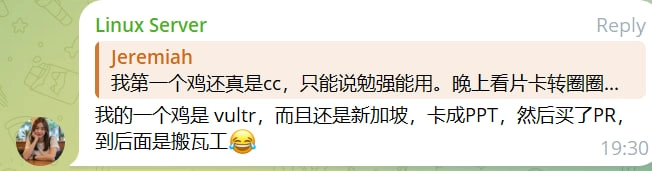

# 搬瓦工MINICHICKEN套餐年付$17.71：1核1G内存、1TB月流量的高性价比VPS限时抢购

---

想找一台价格便宜但性能还过得去的VPS？预算有限但又不想买到那种隔三差五就掉线的垃圾小鸡？搬瓦工这次推出的MINICHICKEN套餐可能正合你意：年付只要$17.71，配置是1核CPU、1GB内存、20GB SSD硬盘，每月1TB流量，1Gbps带宽。虽然不是什么CN2 GIA优化线路,但稳定性和性能已经甩开一堆年付十几刀的便宜货好几条街了。这次采用邀请码机制，数量有限，月底就失效，想要的抓紧。

---

## 这套餐到底什么配置？

看上图就清楚了：
- CPU：1核
- 内存：1GB
- 硬盘：20GB SSD
- 流量：1TB/月
- 带宽：1Gbps
- 机房：弗里蒙特（Fremont）
- 价格：$17.71/年（续费同价）

数据中心在美国加州弗里蒙特，虽然不是CN2 GIA那种优化线路，但三网回程直连，电信用户实测延迟160ms左右。这个价位能拿到搬瓦工的稳定性，已经很划算了。

适合干什么？轻量级建站、跑个代理、测试开发环境、或者就是想长期持有一台海外VPS练手——反正一年不到20美元，比你买个月付套餐划算多了。

## 和其他便宜VPS比怎么样？

市面上确实有更便宜的选择，比如RackNerd那个年付$10.28的套餐。但搬瓦工贵这几美元不是白贵的——稳定性、工单响应速度、控制面板的易用程度，都不在一个档次。

看看网友实际使用后的评价：

👉 如果你需要一台真正能用、不用三天两头折腾的VPS，[搬瓦工这种老牌商家的稳定性保障](https://bandwagonhost.com/aff.php?aff=79616)还是值得多花这几美元的。

## 怎么买？邀请码在哪？

**购买链接**：https://bandwagonhost.com/aff.php?aff=63528&pid=158  
**优惠码**：`BWHCGLUKKB`  
**测试IP**：`45.62.109.126`

这次采用邀请码机制，每个码只能用一次，用完即失效。下面是目前还可能有效的邀请码列表（截至5月26日更新）：

bwh_yQKQl1zaFiTpCab_aff63528  
bwh_uNGC3piypfiGDGc_aff63528  
bwh_R5SrL4ja5OjP4MP_aff63528  
bwh_56sCylSGK7MSEfp_aff63528  
bwh_GXlpeXkoXf37UXJ_aff63528  
bwh_ATGTl443BF1dnwj_aff63528  
bwh_D36OibBsqpyjmi6_aff63528  
bwh_WIQsr2nmVOSNS5a_aff63528  
bwh_1z3Ydc0EvgUTp72_aff63528  
bwh_mTB2cSUp5G4NjMJ_aff63528  
bwh_kE8dscgiHBorlEo_aff63528  
bwh_dQ8EIansqjYkX8X_aff63528  
bwh_wirvmJxtS5U7m6B_aff63528  
bwh_B9iAEQAS9R1X2PW_aff63528  
bwh_Pc56xhGVApQlm3i_aff63528  
bwh_OviWVMDmvC3nqW2_aff63528  
bwh_cB47xsf4dGjUSwO_aff63528  
bwh_0a98XULq66T0j9M_aff63528  
bwh_ccd6aBogwsMFcv1_aff63528  
bwh_Rl2QkPBV6xSPo2P_aff63528  
bwh_14R50SwfYTxBoAX_aff63528  
bwh_gh98XjNo5KMOp1G_aff63528  
bwh_5SANNrvawkTUM8k_aff63528  
bwh_zerycfIQuDq6iGX_aff63528  
bwh_OBGfejxAjTK3Dm1_aff63528  
bwh_NL5598aIPub6rjC_aff63528  
bwh_fY3L38Vqy5a8YEl_aff63528  
bwh_QiWMdWKeuqywmQG_aff63528  
bwh_OVuIwoHiF6dF41a_aff63528  
bwh_gHi2klPUpabOwnu_aff63528  
bwh_32fnBCC8K74ODZF_aff63528  
bwh_E5dMYnYE8dE9S1n_aff63528  
bwh_cVfi8HLBFmzA03p_aff63528  
bwh_wxlA9aNYEM19MK1_aff63528  
bwh_ZNM5VLCxd8JCyzw_aff63528  
bwh_OWT0mT00HvCzve9_aff63528  
bwh_m4NZ0yBsWEqv6PV_aff63528  
bwh_stIckUVaKtwcSRh_aff63528  
bwh_S4cvU2UllHPC2Mi_aff63528  
bwh_O4Cm7M6SNHc9KVR_aff63528  
bwh_SDLUZwNKHZhnraZ_aff63528  
bwh_APU22REYAhwCg6n_aff63528  
bwh_XORzzHWcit2pGjq_aff63528  
bwh_vJ5gCXX6Mnd8Qk5_aff63528  
bwh_38JLy9jkbrE3Hbd_aff63528  
bwh_XxNTDfGqcjEgikq_aff63528  
bwh_eepNPNNZYPgsINt_aff63528  
bwh_MAQqkkwQAy05E9f_aff63528  
bwh_VdjaRZOuPD9VWIy_aff63528  
bwh_flZWB96YQxmHsRG_aff63528

如果一个码提示已被使用，就换下一个试试。活动截止到5月31日凌晨12:00（北京时间），之后所有未使用的邀请码全部失效。

## 几个常见问题

**这套餐适合干什么？**  
建个人网站、科学上网、跑自动化脚本、搭测试环境都行。特别适合预算有限但想体验一下靠谱海外VPS的新手。

**不是CN2线路，中国用户能用吗？**  
能用。弗里蒙特机房三网回程直连，电信用户体验最好，实测延迟160ms左右。虽然比不上CN2 GIA那种专线，但比大多数廉价VPS的绕路强多了。

**为什么要用邀请码？**  
限量销售，防止被瞬间抢光，也让每个真正需要的人都有机会买到。每个邀请码只能用一次，用完就失效。

---

年付不到18美元，续费同价，这个价位能拿到搬瓦工的品牌保障和稳定性能，对于想长期持有一台海外VPS的用户来说性价比确实很高。活动月底就结束，邀请码数量有限，[需要的话现在就下手](https://bandwagonhost.com/aff.php?aff=79616)，别等到失效了再后悔。
